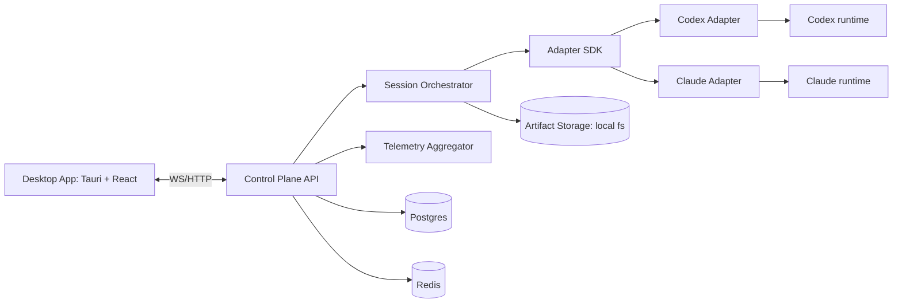

# Agent Command Center (ACC) v1 Engineering Blueprint

## 1. Document Control
- Version: v1.0
- Date: 2026-03-14
- Audience: Product engineering, platform, desktop, QA
- Status: Ready for implementation

## 2. Problem Statement
Teams running multiple AI agents across different LLM providers need a single operations console to supervise, control, and measure sessions in real time.

The system must support:
- Multi-monitor tiled views
- Fast show/hide/focus controls
- Idle/busy/error visibility
- Tool popouts (terminal, logs, artifacts)
- Shared context packs across agents
- Unified usage and cost telemetry across providers

## 3. Scope
### 3.1 In scope (v1)
- Single operator, desktop-first, local control plane
- Up to 24 concurrently active agents in one workspace
- Two adapters: Codex and Claude
- Unified control-plane APIs + websocket stream
- Session lifecycle orchestration + heartbeat + idle detection
- Context packs (snapshot semantics)
- Usage and cost aggregation
- Session replay from persisted event log
- Export/import workspace bundle for handoff

### 3.2 Out of scope (v1)
- Multi-user live collaboration
- Org-grade RBAC
- Cloud distributed orchestration
- Autonomous task decomposition engine
- Fine-tuning/training

## 4. High-Level Architecture


## 5. Monorepo Layout (target)
```text
acc/
  apps/
    desktop/                # Tauri shell + React UI
    control-plane/          # Node/TypeScript API + websocket
  packages/
    adapter-sdk/            # shared adapter contracts
    adapter-codex/          # Codex provider integration
    adapter-claude/         # Claude provider integration
    event-schema/           # zod/json schema for normalized events
    shared-types/           # DTOs, enums, ids
    ui-kit/                 # reusable desktop components
  infra/
    docker-compose.yml      # postgres + redis for local dev
  docs/
    acc-v1-engineering-blueprint.md
```

## 6. Runtime Topology
- Desktop app process:
  - React renderer + Tauri host
  - Connects to local control plane via `http://127.0.0.1:7711`
- Control plane process:
  - Node.js service
  - Persists durable state in Postgres
  - Uses Redis pub/sub for fanout and worker queues
- Adapter workers:
  - Spawn provider runtimes or call provider APIs
  - Emit normalized events only
- Artifact store:
  - Local filesystem path: `~/.acc/artifacts/<workspaceId>/<agentId>/...`

## 7. NFRs (v1 targets)
- Event-to-UI latency p95: < 250 ms
- UI perceived action latency for tile toggle/focus: < 150 ms
- Supports 24 live tiles at > 30 FPS on modern laptop
- Reconnect: UI restart must recover active sessions without data loss
- Usage accounting variance vs provider report: <= 2%

## 8. Domain Model
## 8.1 IDs
- `workspace_id`: `ws_<ulid>`
- `agent_id`: `ag_<ulid>`
- `session_id`: `ss_<ulid>`
- `event_id`: `ev_<ulid>`
- `context_pack_id`: `cp_<ulid>`

## 8.2 Core entities
- Workspace
- AgentSession
- AgentEvent
- ContextPack
- ContextItem
- UsageTick
- Artifact

## 9. Postgres DDL
```sql
create extension if not exists "pgcrypto";

create table workspaces (
  id text primary key,
  name text not null,
  description text,
  layout_config jsonb not null default '{}'::jsonb,
  created_at timestamptz not null default now(),
  updated_at timestamptz not null default now()
);

create type agent_state as enum (
  'CREATED',
  'STARTING',
  'READY',
  'RUNNING',
  'WAITING_INPUT',
  'IDLE',
  'COMPLETED',
  'ERROR',
  'STOPPED'
);

create table agent_sessions (
  id text primary key,
  workspace_id text not null references workspaces(id) on delete cascade,
  provider text not null,
  model text not null,
  title text,
  state agent_state not null default 'CREATED',
  runtime_session_id text,
  heartbeat_at timestamptz,
  last_event_at timestamptz,
  idle_since timestamptz,
  error_code text,
  error_message text,
  started_at timestamptz,
  completed_at timestamptz,
  metadata jsonb not null default '{}'::jsonb,
  created_at timestamptz not null default now(),
  updated_at timestamptz not null default now()
);

create index idx_agent_sessions_workspace on agent_sessions(workspace_id);
create index idx_agent_sessions_state on agent_sessions(state);

create table agent_events (
  id text primary key,
  agent_id text not null references agent_sessions(id) on delete cascade,
  workspace_id text not null references workspaces(id) on delete cascade,
  seq bigint not null,
  event_type text not null,
  ts timestamptz not null,
  provider text not null,
  payload jsonb not null,
  created_at timestamptz not null default now(),
  unique(agent_id, seq)
);

create index idx_agent_events_workspace_ts on agent_events(workspace_id, ts);
create index idx_agent_events_agent_ts on agent_events(agent_id, ts);

create table context_packs (
  id text primary key,
  workspace_id text not null references workspaces(id) on delete cascade,
  name text not null,
  description text,
  version int not null default 1,
  immutable boolean not null default true,
  created_at timestamptz not null default now()
);

create table context_items (
  id text primary key,
  context_pack_id text not null references context_packs(id) on delete cascade,
  item_type text not null check (item_type in ('file', 'url', 'text')),
  value text not null,
  checksum text not null,
  token_estimate int,
  created_at timestamptz not null default now()
);

create table agent_context_mounts (
  agent_id text not null references agent_sessions(id) on delete cascade,
  context_pack_id text not null references context_packs(id) on delete cascade,
  mounted_at timestamptz not null default now(),
  max_context_tokens int,
  primary key (agent_id, context_pack_id)
);

create table usage_ticks (
  id text primary key,
  agent_id text not null references agent_sessions(id) on delete cascade,
  workspace_id text not null references workspaces(id) on delete cascade,
  ts timestamptz not null,
  input_tokens int not null default 0,
  output_tokens int not null default 0,
  cost_usd numeric(12,6) not null default 0,
  latency_ms int,
  metadata jsonb not null default '{}'::jsonb
);

create index idx_usage_ticks_workspace_ts on usage_ticks(workspace_id, ts);
create index idx_usage_ticks_agent_ts on usage_ticks(agent_id, ts);

create table artifacts (
  id text primary key,
  agent_id text not null references agent_sessions(id) on delete cascade,
  workspace_id text not null references workspaces(id) on delete cascade,
  kind text not null check (kind in ('log', 'file', 'patch', 'trace')),
  uri text not null,
  size_bytes bigint,
  created_at timestamptz not null default now()
);
```

## 10. Redis Usage
- Channel: `ws:<workspace_id>:events`
  - Fanout normalized events to all subscribed UI clients
- Stream/list: `orchestrator:commands`
  - Enqueue start/interrupt/stop commands for workers
- Key: `session:<agent_id>:heartbeat`
  - Last adapter heartbeat epoch

No business-critical state is Redis-only; Postgres is source of truth.

## 11. State Machine
## 11.1 Transitions
- `CREATED -> STARTING`
- `STARTING -> READY | ERROR`
- `READY -> RUNNING | WAITING_INPUT | STOPPED`
- `RUNNING -> WAITING_INPUT | IDLE | COMPLETED | ERROR | STOPPED`
- `WAITING_INPUT -> RUNNING | STOPPED`
- `IDLE -> RUNNING | STOPPED | ERROR`
- Terminal: `COMPLETED`, `ERROR`, `STOPPED`

## 11.2 Idle/stale detection
- Idle threshold: 120 seconds
- Stale heartbeat threshold: 30 seconds
- Worker loop (every 5 seconds):
  1. If `now - last_event_at >= 120s` and no pending tool call -> set `IDLE`
  2. If `now - heartbeat_at >= 30s` and state not terminal -> emit `ERROR` with `HEARTBEAT_TIMEOUT`

## 12. Adapter SDK Contract
```ts
export type ProviderId = "codex" | "claude" | (string & {});

export interface StartSessionReq {
  agentId: string;
  model: string;
  systemPrompt?: string;
  cwd?: string;
  env?: Record<string, string>;
  contextItems?: Array<{ id: string; type: "file" | "url" | "text"; value: string }>;
}

export interface SendInputReq {
  sessionId: string;
  input: string;
  attachments?: Array<{ type: "file" | "text"; value: string }>;
}

export interface AdapterStatus {
  sessionId: string;
  state: "ready" | "running" | "waiting_input" | "completed" | "error" | "stopped";
  lastHeartbeatAt: string;
  providerModel?: string;
}

export type AgentEventType =
  | "SESSION_STARTED"
  | "STATUS_CHANGED"
  | "OUTPUT_DELTA"
  | "OUTPUT_FINAL"
  | "TOOL_CALL_STARTED"
  | "TOOL_CALL_FINISHED"
  | "HEARTBEAT"
  | "USAGE_TICK"
  | "ERROR"
  | "SESSION_COMPLETED";

export interface AgentEvent<T = unknown> {
  eventId: string;
  seq: number;
  ts: string;
  workspaceId: string;
  agentId: string;
  provider: ProviderId;
  type: AgentEventType;
  payload: T;
}

export interface AgentAdapter {
  readonly provider: ProviderId;
  startSession(req: StartSessionReq): Promise<{ sessionId: string }>;
  sendInput(req: SendInputReq): Promise<void>;
  interrupt(req: { sessionId: string }): Promise<void>;
  stop(req: { sessionId: string }): Promise<void>;
  getStatus(req: { sessionId: string }): Promise<AdapterStatus>;
  attachContext(req: { sessionId: string; contextIds: string[] }): Promise<void>;
  streamEvents(req: { sessionId: string; onEvent: (event: AgentEvent) => void }): Promise<() => Promise<void>>;
}
```

## 13. Provider Adapter Notes
## 13.1 Codex adapter
- Runtime mode: CLI process per session
- Capture stdout/stderr incrementally as `OUTPUT_DELTA`
- Map process exit code to `SESSION_COMPLETED` or `ERROR`
- Emit heartbeat on every output tick, plus fixed 10-second heartbeat timer

## 13.2 Claude adapter
- Runtime mode: API or CLI (implementation detail behind same contract)
- Stream assistant deltas as `OUTPUT_DELTA`
- Normalize tool events into `TOOL_CALL_STARTED/FINISHED`
- Convert provider token usage to `USAGE_TICK`

## 14. Control Plane API (REST + WS)
Base URL: `/api/v1`

## 14.1 Workspaces
- `POST /workspaces`
  - req: `{ "name": "Core Project", "description": "..." }`
  - res: `201 { workspace }`
- `GET /workspaces/:id`
  - res: `200 { workspace, agentsSummary, usageSummary }`

## 14.2 Agents
- `POST /agents`
  - req: `{ "workspaceId": "...", "provider": "codex", "model": "...", "title": "...", "systemPrompt": "...", "contextPackIds": [] }`
  - res: `201 { agent }`
- `GET /agents/:id`
  - res: `200 { agent, mounts, latestUsage }`
- `POST /agents/:id/input`
  - req: `{ "input": "...", "attachments": [] }`
  - res: `202 { accepted: true }`
- `POST /agents/:id/interrupt`
  - res: `202 { accepted: true }`
- `POST /agents/:id/stop`
  - res: `202 { accepted: true }`

## 14.3 Context
- `POST /contexts`
  - req: `{ "workspaceId":"...", "name":"Sprint Brief", "items":[...] }`
  - res: `201 { contextPack }`
- `POST /contexts/:id/mount`
  - req: `{ "agentIds":[...], "maxContextTokens": 8000 }`
  - res: `200 { mounted: n }`

## 14.4 Usage + replay
- `GET /usage?workspaceId=...&window=1h|24h`
- `GET /agents/:id/events?cursor=...&limit=500`
- `GET /agents/:id/artifacts`

## 14.5 Websocket stream
- `GET /stream?workspaceId=<id>`
- Server pushes normalized `AgentEvent` plus periodic aggregate messages:
  - `{ type: "USAGE_ROLLUP", payload: ... }`
  - `{ type: "WORKSPACE_HEALTH", payload: ... }`

## 15. UI Engineering Blueprint
## 15.1 Tech stack
- Tauri + React + TypeScript
- State: Zustand (UI local) + TanStack Query (server cache)
- Virtualized output panes for large streams
- `xterm.js` for terminal popout

## 15.2 App routes
- `/workspaces`
- `/workspace/:id/grid`
- `/workspace/:id/focus/:agentId`
- `/workspace/:id/replay/:agentId`
- `/settings/providers`

## 15.3 Component tree
- `AppShell`
  - `TopNav`
  - `OpsBar`
  - `GridCanvas`
    - `AgentTile`
      - `StatusBadge`
      - `OutputPreview`
      - `QuickActions`
  - `RightDrawer`
    - `UsagePanel`
    - `ContextPanel`
    - `ArtifactPanel`
  - `BottomPanel`
    - `EventTimeline`
    - `TerminalPopoutHost`

## 15.4 Client state shape
```ts
type UiState = {
  activeWorkspaceId?: string;
  layoutByWorkspace: Record<string, {
    tiles: Array<{ agentId: string; x: number; y: number; w: number; h: number; hidden: boolean; monitor: number }>;
    focusedAgentId?: string;
    filters: { provider?: string; state?: string; idleOnly?: boolean; errorOnly?: boolean };
  }>;
  drawers: {
    rightOpen: boolean;
    bottomOpen: boolean;
    terminalByAgent: Record<string, boolean>;
  };
  stream: {
    connected: boolean;
    lastSeqByAgent: Record<string, number>;
  };
};
```

## 15.5 UX behavior rules
- Tile badge colors:
  - Running: blue
  - Idle: yellow
  - Error: red
  - Completed: green
- Single-key actions:
  - `f`: focus selected tile
  - `h`: hide/show selected tile
  - `i`: filter idle
  - `e`: filter errors
- Focus mode preserves underlying tile layout state

## 16. Context Pack Semantics
- Packs are immutable snapshots once mounted
- Updating context means creating new pack version
- Mount operation emits `STATUS_CHANGED` + audit event
- On replay, exact mounted context version is recoverable

## 17. Usage and Cost Model
## 17.1 Tick ingestion
- Source: adapter events, per response chunk or completion
- Fields: input tokens, output tokens, estimated cost, latency
- Persist every tick; aggregate at query time + cached rollups

## 17.2 Cost estimation
- Provider-model pricing table in config
- Cost formula:
  - `cost_usd = (input_tokens * in_price + output_tokens * out_price) / 1_000_000`
- If provider returns authoritative cost, store as `metadata.authoritative=true`

## 18. Security
- API keys stored in OS keychain (desktop settings)
- Control plane stores only encrypted key references when needed
- Redaction pipeline removes secrets from event payloads before persistence
- Artifacts inherit workspace ownership; no cross-workspace access
- Optional local-only mode disables outbound analytics

## 19. Observability
- Structured logs with `workspaceId`, `agentId`, `eventId`
- Metrics:
  - `event_ingest_lag_ms`
  - `ws_fanout_latency_ms`
  - `agent_state_transition_total`
  - `adapter_error_total{provider=...}`
  - `heartbeat_timeout_total`
- Trace critical path: adapter event -> persist -> fanout -> UI receive

## 20. Testing Strategy
## 20.1 Unit
- State machine transition tests
- Event schema validation tests
- Cost aggregation tests
- Context mount immutability tests

## 20.2 Integration
- Mock adapter emits deterministic stream
- API + WS end-to-end in ephemeral Postgres/Redis
- Recovery test: restart API while agents running

## 20.3 E2E desktop
- Launch 10 mixed-provider sessions
- Verify grid responsiveness and badge correctness
- Interrupt/stop/restart flows
- Replay timeline consistency

## 20.4 Load and reliability
- Synthetic 24-agent load for 30 minutes
- Measure p95 latencies and dropped events
- Heartbeat timeout fault injection

## 21. Delivery Plan (6 weeks)
1. Week 1: bootstrap monorepo, DB schema, control plane skeleton, WS channel
2. Week 2: orchestrator + state machine + mock adapter
3. Week 3: Codex adapter + terminal integration + artifacts
4. Week 4: Claude adapter + usage pipeline + cost rollups
5. Week 5: desktop grid/focus/drawers + context pack workflows
6. Week 6: replay, perf hardening, E2E, packaging

## 22. Exit Criteria (Definition of Done)
- Can run 10+ mixed-provider agents in one workspace
- Idle/busy/error status accuracy within 3 seconds
- Show/hide/focus actions meet latency target
- Usage totals within 2% of provider reports or documented estimate source
- Replay reproduces full event timeline including context mounts and tool calls
- QA pass on Windows/macOS local dev targets (Linux optional for v1)

## 23. Open Risks and Mitigations
- Provider API/CLI drift
  - Mitigation: adapter conformance tests + feature flags per provider version
- High output volume causing UI jank
  - Mitigation: virtualization, chunked rendering, backpressure in WS client
- Token/cost mismatch
  - Mitigation: store both estimated and provider-authoritative fields
- Session zombie processes
  - Mitigation: process supervisor + periodic orphan reaper

## 24. First Implementation Tickets (ready to create)
1. `CP-001`: Initialize control plane service, health endpoints, config loader
2. `DB-001`: Apply baseline DDL and migration pipeline
3. `ORCH-001`: Implement agent state machine + transition guardrails
4. `EVT-001`: Build normalized event validator and serializer
5. `ADP-001`: Implement mock adapter for deterministic testing
6. `UI-001`: Scaffold desktop shell + workspace grid + websocket client
7. `CTX-001`: Implement context pack CRUD + mount endpoint
8. `TEL-001`: Usage tick ingestion + aggregate endpoint
9. `RPL-001`: Session replay API + timeline panel
10. `E2E-001`: 10-agent mixed-provider smoke test
